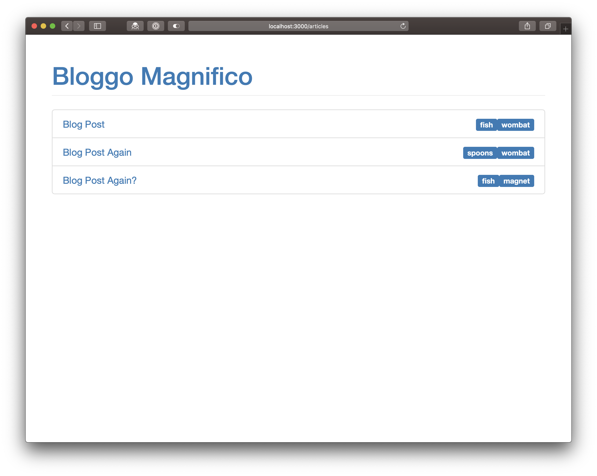
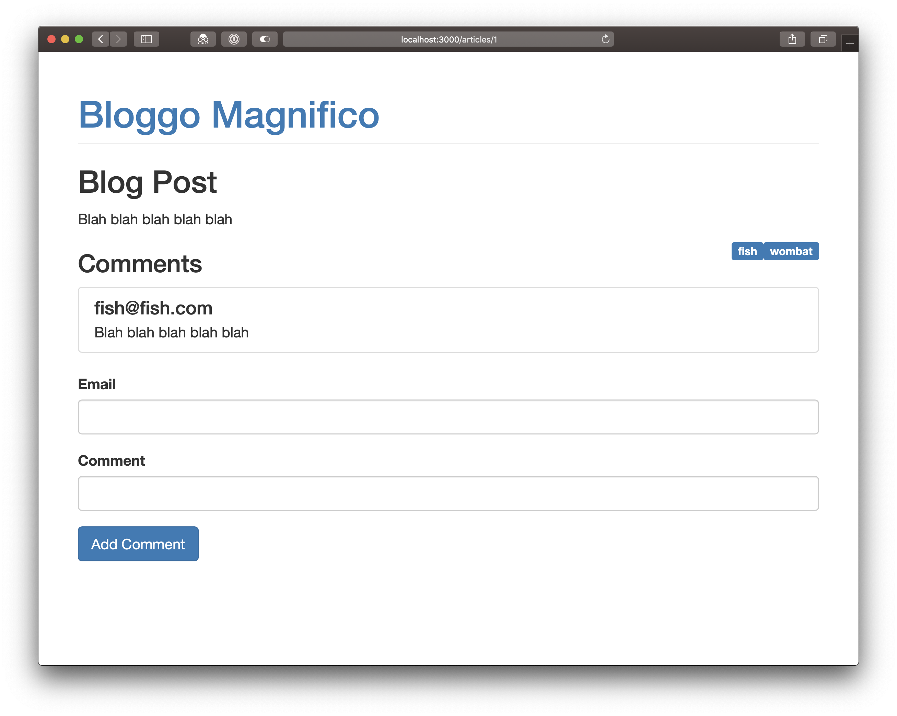
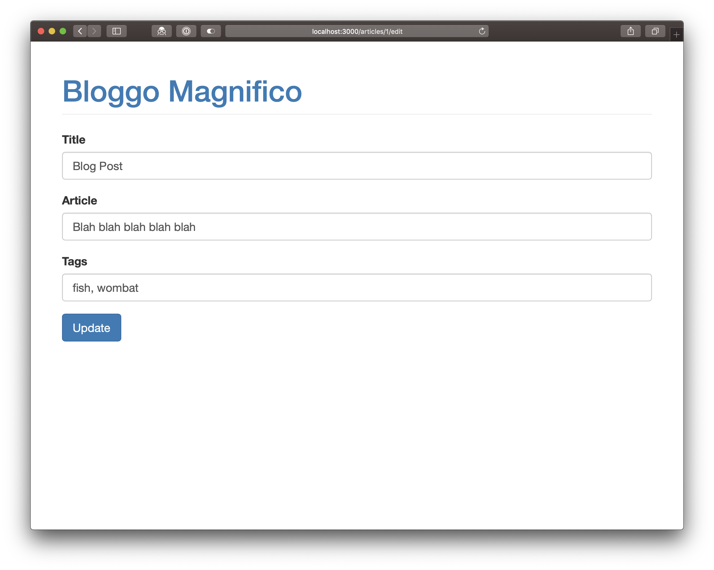

# Challenges

**Use Git to make a commit every time you get an answer working. Use sensible commit messages.**

Make sure you keep React DevTools + JS console open at all times and correct anything that it flags up. Use the Network panel to check things are working as you'd expect.

## APIs with React

For all of these challenges use the `restful.training` API that you worked with in the Laravel week.

These challenges all involve making a `GET` request when a component first loads. You should show a loading message until you get back a response:

- Create a component `<Articles>` which lists all of the articles. It should show when you visit `/articles`

- Create a component `<Article id={ number }>` which shows a specific article based on its `id`. It should show when you visit `/articles/{id}`
    - Update your `<Articles>` component to link through to `<Article>`

- Create a component `<Comments articleID={ number }>` which lists all of the comments for a given article.
    - Update your `<Article>` component to use the `<Comments>` component at the bottom

These challenges all involve sending data to the server when a form is submitted.

- Create a component `<CreateArticle>` which allows you to submit an article to the API. You should be able to get to it by visiting `/articles/create`

- Create a component `<CreateComment>` which allows you to submit a comment for a specific article to the API
    - Add it to the `<Article>` component  above the `<Comments>` component

## Tricksy

- Create a component `<EditArticle>` which allows you to update an article. You should be able to get to it by visiting `/articles/{id}`. It will need to load the article information when the component first loads and submit it with a `PUT` request when the form is submitted.

- Update your `<Article>` and `<EditArticle>` components to show a 404 message if it isn't found on the server

## Über-Tricksy

- If you submit incorrect data to `<CreateArticle>`, `<CreateComment>` or `<EditArticle>` you will get a `422` response. Use this to show validation errors to the user. You'll need to use Axios' error handling.
