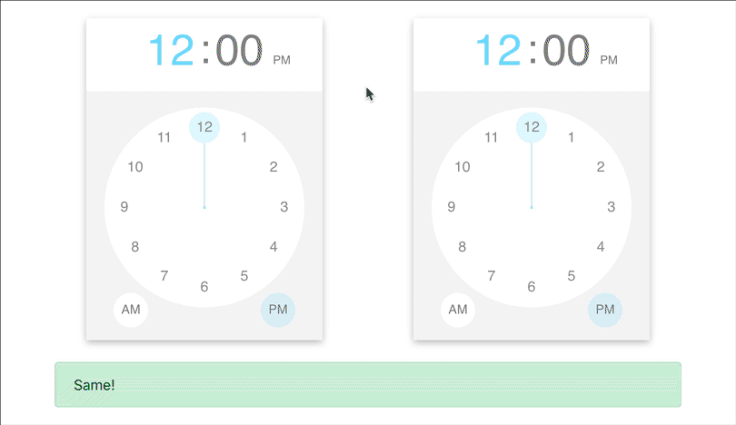

# Challenges

- **Use Git to make a commit every time you get an answer working. Use sensible commit messages.**

- For some of these challenges you may want to create more than one component type. Try not to let your JSX get too unwieldy. Create new directories if you're using multiple component types.

- Make sure you keep React DevTools ([Firefox](https://addons.mozilla.org/en-US/firefox/addon/react-devtools/)/[Chrome](https://chrome.google.com/webstore/detail/react-developer-tools/fmkadmapgofadopljbjfkapdkoienihi)) + JS console open at all times and correct anything that it flags up.

- You'll need to read the appropriate documentation to answer some of these questions.

## Pre-Built Components

### React Bootstrap

Remember to install React Bootstrap (`npm install react-bootstrap`) before starting these challenges.

[React Bootstrap Documentation](https://react-bootstrap.github.io/components/alerts/)

1) **Using only React Bootstrap components** (there shouldn't be *any* HTML elements), create a `<Progress>` component. It should have a [progress bar](https://react-bootstrap.github.io/components/progress/) and a "More!" button. The progress bar should start at 0. Each time the button is pressed it should move 10% further along until it reaches 100%. Once it reaches 100% the button should become disabled.

2) **Using only React Bootstrap components** (there shouldn't be *any* HTML elements), create a `<CatchMeIfYouCan jump={ 100 }>` component. It should have a button that when clicked moves `jump` pixels down the screen.

3) **Using only React Bootstrap components** (there shouldn't be *any* HTML elements), create a `<PasswordStrength>` component. It should contain an input with the type `password`. The background styling should change depending on the length of the password:

    - If it's empty the background shouldn't have styling.
    - If it's less than 9 it should be red.
    - If it's less than 16 it should be orange.
    - If it's 16 or more then it should be green.

4) **Using only React Bootstrap components** (there shouldn't be *any* HTML elements), create a `<List>` component that consists of a list group, an input, and an "Add" button. When you click the button, whatever is in the input should get added to the list group.

5) **Using only React Bootstrap components** (there shouldn't be *any* HTML elements), create a `<TempConverter>` component. It should have a `°F` and `°C` input. When you type a number into one input it should update the value in the other.

### Other Components

6) Use [React DatePicker](https://github.com/Hacker0x01/react-datepicker/) to create a component `<Dates>`. It should have two date pickers and a React Bootstrap `<Alert>`. The alert should show the number of days between the two dates.

    


7) Use [React Images](https://jossmac.github.io/react-images/) to create a carousel that uses the following images:

    ```
    https://cutt.ly/ke3x2y5
    https://cutt.ly/ee3x2lR
    https://cutt.ly/re3x2LP
    ```

    


8) Use [React Color](http://casesandberg.github.io/react-color/) to create a `<Headline>` component with a `message` prop. It should display the message with *massive* lettering. When you click on the headline it should show a colour picker. When you select a colour the text colour of the message should change.

    


## Tricksy

These next ones are tricky because the given examples use "Hooks", but you should **do it using a class based component**.

All you need to know is that the `onChange` event handler is passed the value from the component as its first argument in the same way that React Datepicker does.

If you ever want to see what arguments are being passed to a function you can use the spread operator to get back an array of the arguments.  You should only use this code for debugging purposes.

```javascript
handleBlah(...args) {
    console.log(args);
}
```

- use [React TimeKeeper](https://catc.github.io/react-timekeeper/) to create a `<Times>` component. It should have two time keepers. There should also be a React Bootstrap `<Alert>` component at the bottom. If the two times match then the alert should be green and display "Same!". If they do not match the alert should be red and display "Different!".

    

- Use [React MarkDown Editor](https://github.com/uiwjs/react-md-editor) to create a `<MarkDown>` component that displays a MarkDown editor and a MarkDown preview. The editor should have the `preview` prop set to `edit`.  The preview should be wrapped in a React Bootstrap `<Card>` component.

    

---

This next one's tricky because the documentation isn't all that great. You can view code examples by clicking on the little source-code icon.

- Use [React Select](https://react-select.com/home) to create a component `<Selector>` that has an `animals` prop that you pass an array of animal names. When you select an animal it should display in a Bootstrap `<Alert>` component: "Favourite Animals: *selected animal*".

    


---

For the following challenges you'll want to look at the relevant "Components" documentation.

- Recreate the React Bootstrap challenges above using [React Suite](https://rsuitejs.com/en/)

- Recreate the React Bootstrap challenges above using [React Rainbow](https://react-rainbow.web.app)


## Über-Tricksy

[React Native](https://facebook.github.io/react-native/docs/getting-started.html) can be used to make native phone apps using React.

*You'll need to create a new React Native app* in a new directory by following the guide in the documentation.

Create a `<List>` component that consists of a list, an input, and an "Add" button. When you click the button, whatever is in the input should get added to the list group.

You'll need the following components:

- [TextInput](https://facebook.github.io/react-native/docs/textinput)
- [Buttons](https://facebook.github.io/react-native/docs/button)
- [FlatList](https://facebook.github.io/react-native/docs/flatlist)
